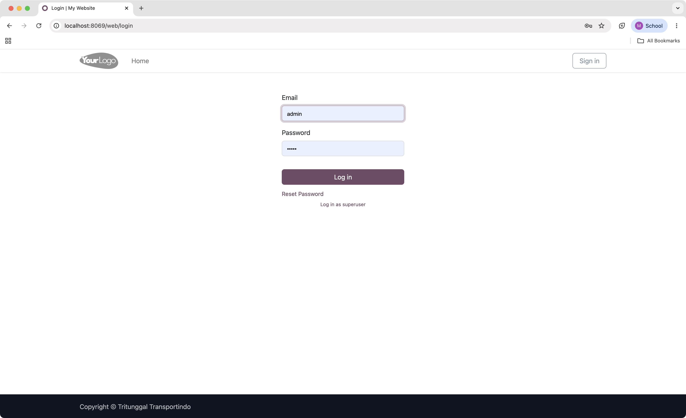
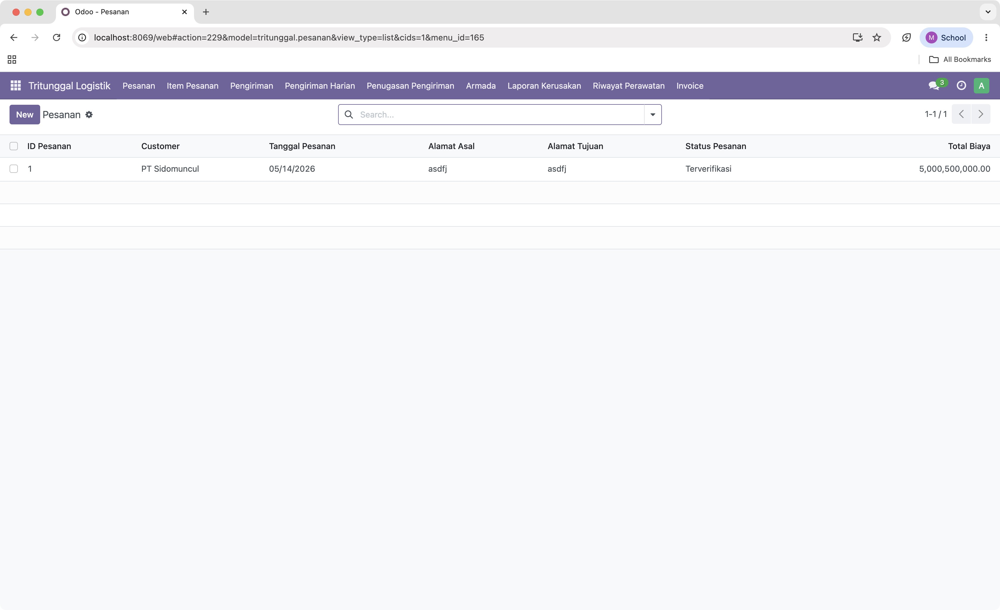

# Implementasi Sistem ERP Berbasis Odoo untuk Mendukung Operasional CV Tritunggal Transporindo

## Identitas Proyek

**Mata Kuliah**: IF3141 Sistem Informasi  
**Nama Sistem**: Sistem Informasi Logistik Tritunggal  
**Perusahaan**: CV Tritunggal Transportindo  
**Nomor Kelompok**: G06  
**Nomor Kelas**: K01

## Anggota Kelompok

| Nama | NIM |
|---|---:|
| Maheswara Bayu Kaindra | 13523015 |
| Richard Christian | 13523024 |
| Fajar Kurniawan | 13523027 |
| Rafizan Muhammad Syawalazmi | 13523034 |
| Ivan Wirawan | 13523046 |

## Deskripsi Sistem

Sistem Informasi Logistik Tritunggal adalah aplikasi Odoo kustom yang dirancang untuk mendukung proses operasional CV Tritunggal Transportindo dalam pengelolaan pesanan, item pesanan, pengiriman, penugasan armada, laporan kerusakan, riwayat perawatan, dan invoice. Sistem ini memusatkan data operasional ke dalam satu platform agar alur kerja antarbagian dapat berjalan lebih terkontrol, terdokumentasi, dan mudah ditelusuri.

Selain mengelola proses inti logistik, sistem ini juga menyediakan pengaturan akses berbasis peran agar tiap pengguna hanya dapat melihat dan memproses data sesuai tanggung jawabnya. Marketing fokus pada pesanan dan item pesanan, operasional menangani penugasan dan armada, supir melihat penugasan harian serta membuat laporan kerusakan, maintenance mengelola histori perawatan, dan keuangan memantau pengiriman serta invoice. Dengan pembagian peran tersebut, sistem menjadi lebih aman, terstruktur, dan sesuai dengan kebutuhan bisnis perusahaan.

## Struktur Repository

- `config/` untuk konfigurasi Odoo
- `custom_addons/` untuk modul kustom Tritunggal Logistik
- `dump/` untuk file backup database
- `scripts/` untuk export dan import database
- `docs-screenshots/` untuk tangkapan layar expected result
- `docker-compose.yml` untuk orkestrasi Odoo dan PostgreSQL

## Cara Menjalankan Sistem

### 1. Jalankan container

```bash
docker compose up -d
docker compose ps
```

Expected result:
- Service `db` dan `web` berada dalam status `Up`
- Port Odoo tersedia pada `http://localhost:8069`

### 2. Buka halaman login Odoo

Buka browser ke:

http://localhost:8069/web/login

Expected result:



Halaman login Odoo tampil dan siap menerima kredensial.

### 3. Login menggunakan akun Admin

Gunakan kredensial berikut:

- Username: `admin`
- Password: `admin`

Expected result:



Setelah login, pengguna langsung diarahkan ke modul Tritunggal Logistik pada menu **Pesanan**.

Menu yang tampil mencakup **Pesanan**, **Item Pesanan**, **Pengiriman**, **Pengiriman Harian**, **Penugasan Pengiriman**, **Armada**, **Laporan Kerusakan**, **Riwayat Perawatan**, dan **Invoice**.

### 4. Jika aplikasi belum muncul

Jika modul belum terlihat pada lingkungan baru, lakukan langkah berikut:

1. Login sebagai `admin`
2. Buka menu **Apps**
3. Pilih **Update Apps List**
4. Cari modul **Tritunggal Logistik**
5. Klik **Activate** atau **Upgrade** bila modul sudah pernah terpasang

Expected result:
- Modul Tritunggal Logistik muncul di daftar aplikasi
- Menu utama modul tersedia setelah login

### 5. Jalankan peran lain untuk pengujian

Setelah login admin berhasil, Anda dapat mencoba akun peran lain untuk menguji akses masing-masing role.

Expected result:
- Marketing dapat mengelola pesanan dan item pesanan
- Operasional dapat mengelola proses operasional yang sesuai hak akses
- Supir dapat melihat penugasan harian dan membuat laporan kerusakan
- Maintenance dapat mengelola perawatan armada
- Keuangan dapat memantau data yang berkaitan dengan pengiriman dan invoice

## Kredensial Role

| Role | Username | Password |
|---|---|---|
| Admin | `admin` | `admin` |
| Marketing | `marketing` | `marketing123` |
| Operasional | `operasional` | `operasional123` |
| Maintenance | `maintenance` | `maintenance123` |
| Supir | `supir` | `supir123` |
| Keuangan/Kasir | `finance` | `finance123` |
| Customer Portal | `customer` | `customer123` |

## Catatan Pengembangan dan Migrasi Database

Jika Anda mengubah model, view, security, atau data XML, jalankan upgrade modul agar perubahan masuk ke database:

```bash
docker-compose exec web bash -lc "odoo -u tritunggal_logistik -d postgres --stop-after-init"
docker-compose restart web
```

Jika ingin memindahkan state database ke anggota tim lain, gunakan skrip berikut:

- macOS/Linux:

  ```bash
  ./scripts/export_db.sh
  ./scripts/import_db.sh
  ```

- Windows:

  ```bat
  scripts\export_db.cmd
  scripts\import_db.cmd
  ```

Sebelum proses migrasi database, hentikan stack terlebih dahulu bila diperlukan:

```bash
docker compose down
```

## Kesimpulan dan Saran

Sistem Informasi Logistik Tritunggal berhasil menyatukan proses pesanan, pengiriman, armada, dan pelaporan ke dalam satu aplikasi terpusat sehingga alur kerja perusahaan menjadi lebih terstruktur. Pengaturan akses berbasis peran juga membantu menjaga data tetap sesuai tanggung jawab masing-masing pengguna.

Sebagai pengembangan berikutnya, sistem dapat diperluas dengan notifikasi real-time, dashboard analitik operasional, serta validasi yang lebih ketat pada integrasi GPS dan alur approval agar proses logistik menjadi lebih efisien dan mudah dipantau.